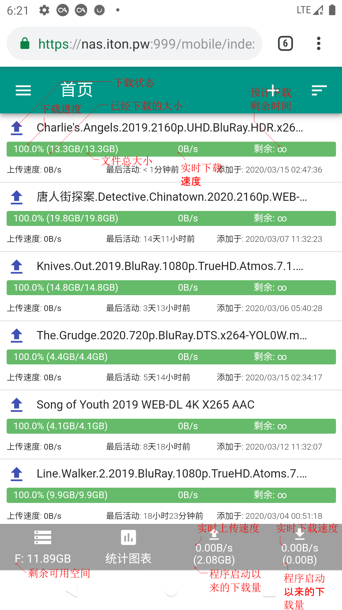
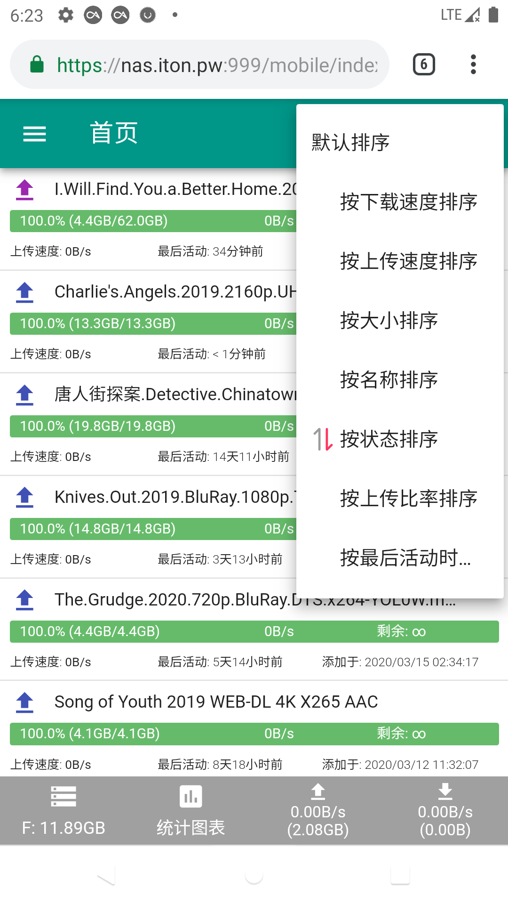
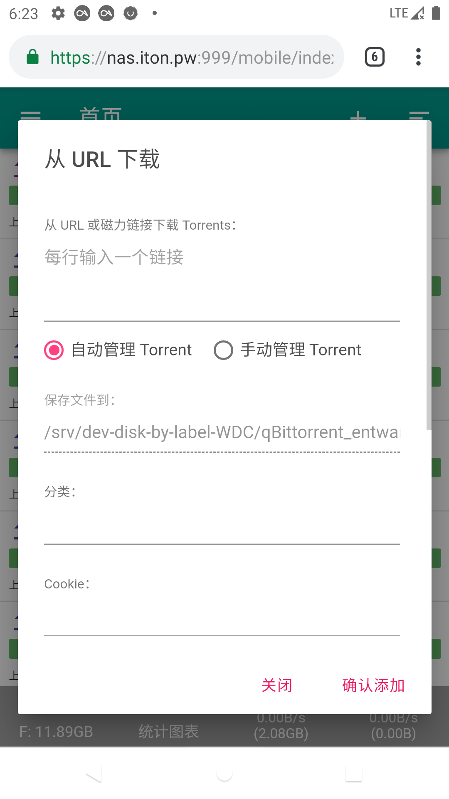
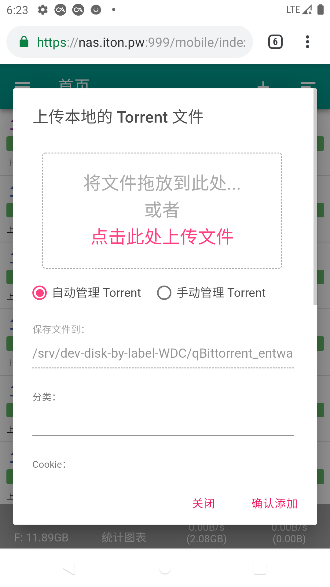
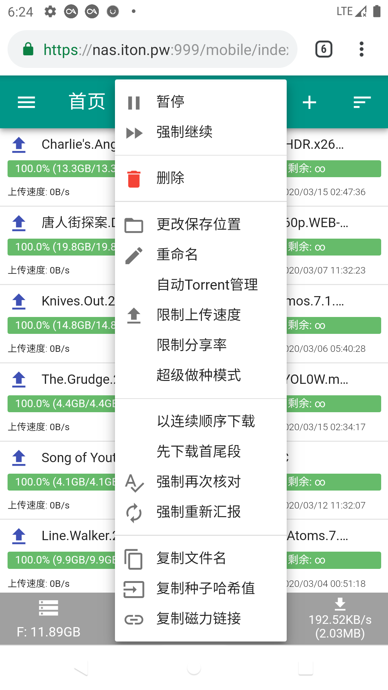
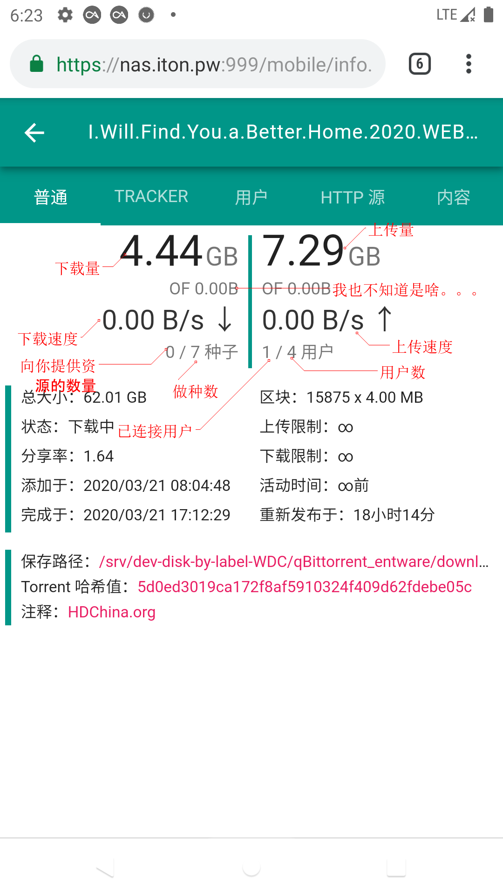
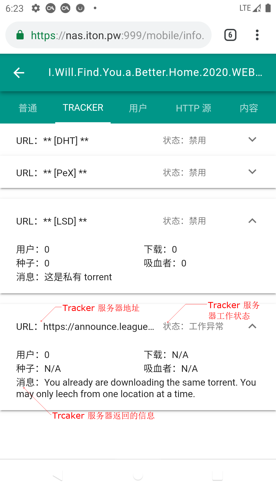
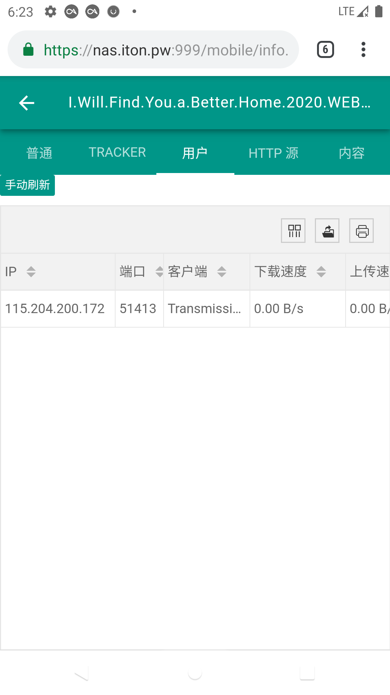
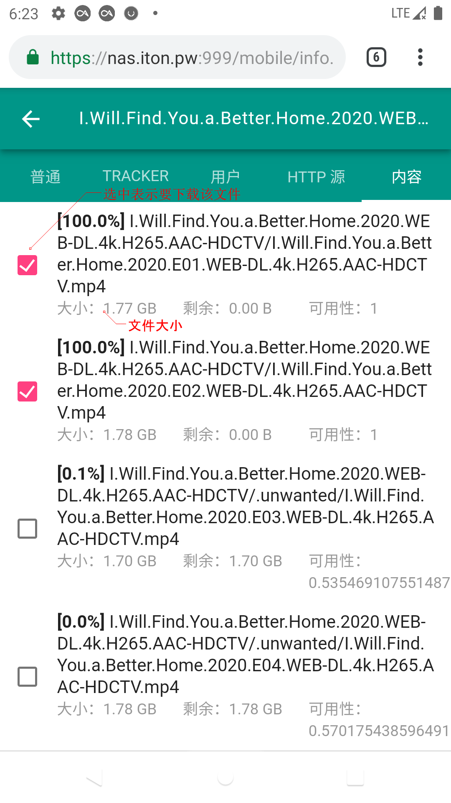
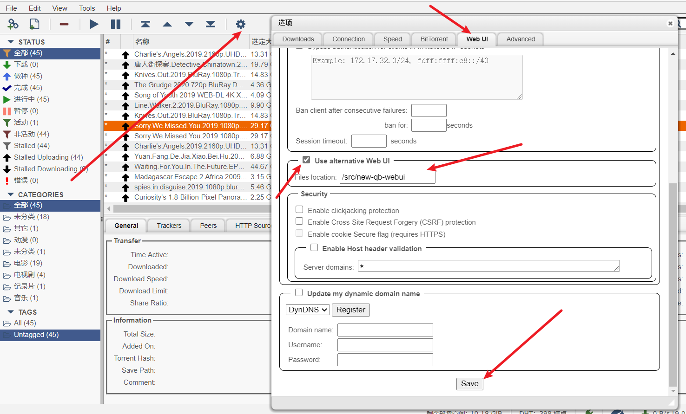

# MD-qBittorrent-web-ui
[](https://gitee.com/wenzhouchan/MD-qBittorrent-web-ui/stargazers)

基于 MDUI 前端框架设计的手机专属 qBittorrent WEB UI（后续会做电脑版），涵盖了 70% 官方 WEB UI 能做到的功能

# 截图
首页：


排序：


添加 URL 下载：


添加 种子文件 下载：


长按下载项目菜单


下载项目详细信息 - 普通


下载项目详细信息 - Tracker


下载项目详细信息 - 用户


下载项目详细信息 - 内容


# 使用到的框架
- [MDUI](https://github.com/zdhxiong/mdui)
    - 基础界面显示
- [LayUI](https://github.com/sentsin/layui/)
    - 使用到了表格 
- [Vue](https://github.com/vuejs/vue)
    - 数据绑定、页面渲染

# 使用方法

## 1.直接使用<对 qBittorrent 版本有要求>

### Ⅰ.下载 Release 版 <选择最新版下载即可>
下载链接：https://github.com/PrintNow/MD-qBittorrent-web-ui/releases/

### Ⅱ.解压
> 假设我解压到 `/src/new-qb-webui`，解压后，此目录下 `/src/new-qb-webui` 结构应该是这样的
```
│  tstool.py
│  webui.qrc
├─private
├─public
└─translations
```

### Ⅲ.启用备用 WebUI
> 按照图片示意操作即可



### Ⅳ.打开
请先清理浏览器缓存，然后访问：`http://<你的IP>:<端口号>/mobile/index.html`

### Ⅴ.打开的界面应该如 [截图](#截图) 所示


## 2.根据官方文档：
> 官方文档：https://github.com/qbittorrent/qBittorrent/wiki/Alternate-WebUI-usage

### 修改配置文件 (qbittorrent.conf)：
```
WebUI\AlternativeUIEnabled=<true>/<false>
WebUI\RootFolder=<new folder>
```

### 下载 WebUI 
https://github.com/PrintNow/MD-qBittorrent-web-ui/archive/master.zip

### 复制文件
https://github.com/qbittorrent/qBittorrent/tree/master/src/webui/www to `a <new folder>`
https://github.com/qbittorrent/qBittorrent/tree/master/src/icons to `<new folder>/public/images`
https://github.com/qbittorrent/qBittorrent/tree/master/src/icons to `<new folder>/private/images`

> 在选项上启用 `WebUI\AlternativeUIEnabled`，并将条目 `WebUI\RootFolder` 指向 <new folder>，然后启动 `qBittorrent`。 
> 然后访问 `http://<IP地址>:<端口号>/index.html`

[](https://gitee.com/wenzhouchan/MD-qBittorrent-web-ui)

# LICENSE
[LICENSE](LICENSE)
